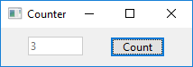
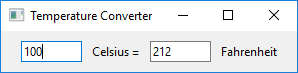
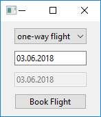
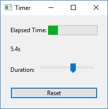
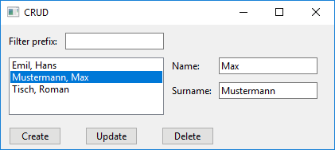
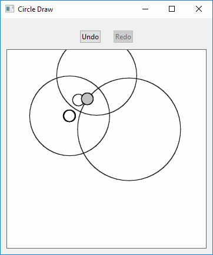
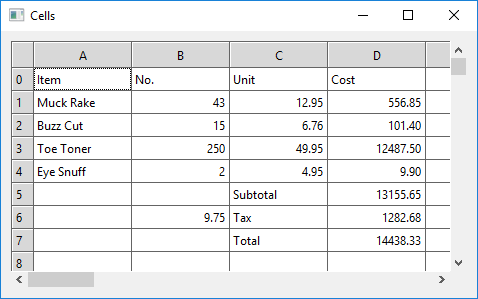

To run these demos, you need to install Phix - which can be done in less than 60 seconds.

Download from: http://phix.x10.mx/downloads.php

On windows, a single 16MB download contains everything needed. I recommend the 32-bit version, which works fine on a 64-bit OS.
On linux (not as thoroughly tested as the windows version), you may need to install IUP separately.

Simply run 'p pdemo' from the directory where you installed/extracted phix, type in "7guis" to limit the list to seven entries, 
and press that there "run" button thing - simples.

Screenshots:

Counter

Temperature Converter

Flight Booker

Timer

CRUD

Circle Drawer

Cells

